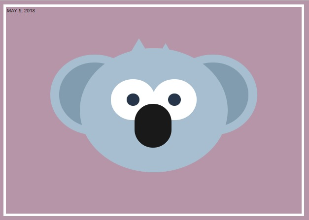

# Pure CSS Challenge: Images Using CSS

## Overview

After seeing this image (https://github.com/cyanharlow/purecss-francine) go viral on Twitter I decided to spend sometime practicing my own CSS skills. Started by following along with https://medium.com/coding-artist/a-beginners-guide-to-pure-css-images-ef9a5d069dd2

*May 7, 2018* 

## Other Pure CSS Images

* https://github.com/pennmeg/pure_css_desk-flatlay
* https://github.com/pennmeg/pure_css_pixel_heart
* https://github.com/pennmeg/pure_css_laptop
* https://github.com/pennmeg/pure_css_pug
* https://github.com/pennmeg/pure_css_tayles
* https://github.com/pennmeg/pure_css_cat
* https://github.com/pennmeg/pure_css_duck
* https://github.com/pennmeg/pure_css_ocanada
* https://github.com/pennmeg/pure_css_corgi
* https://github.com/pennmeg/pure_css_space_giraffe
